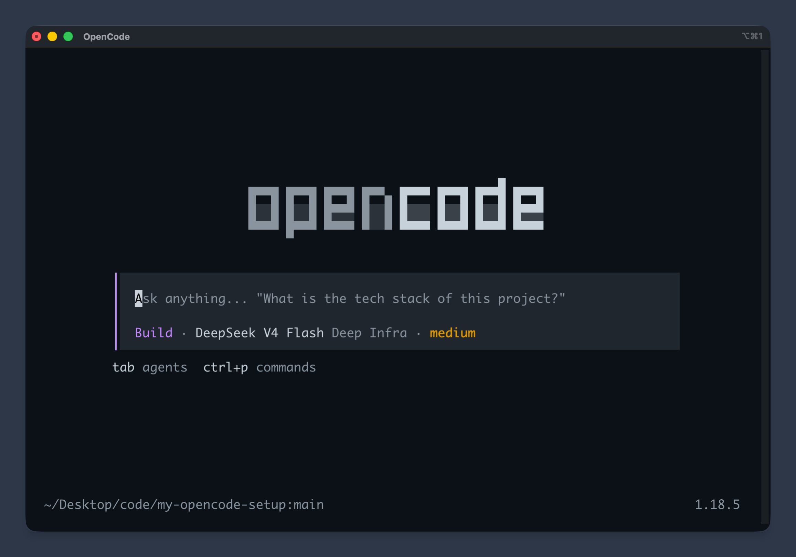

# my-opencode-setup

```bash
curl -fsSL https://raw.githubusercontent.com/DuckKota/my-opencode-setup/refs/heads/main/bin/setup \
    | bash
```

* **Commands:** [/commit-message](./src/commands/commit-message.md) • [/grill-me](./src/commands/grill-me.md) • [/handoff](./src/commands/handoff.md)
* **Skills:** [diagnosing-bugs](./src/skills/diagnosing-bugs/) • [codebase-design](./src/skills/codebase-design/) • [domain-modeling](./src/skills/domain-modeling/) • [improve-codebase-architecture](./src/skills/improve-codebase-architecture/)
* **Tools:** [rtk](https://www.rtk-ai.app/) • [codebase-memory-mcp](https://deusdata.github.io/codebase-memory-mcp/)
* **Other:** [caveman](./src/instructions/caveman.md) • [batch-file-writes](./src/instructions/file-edit-limits.md) • [github-dark-default](./src/themes/github-dark-default.json) theme



<div align="center">
    Apache 2.0
</div>